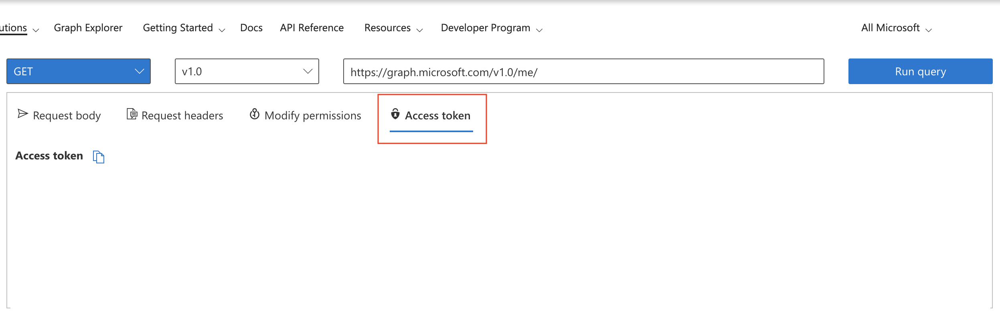

# deleteSPN
Powershell script for deleting SPN

Get the Auth token from https://developer.microsoft.com/en-us/graph/graph-explorer -> Sign in -> Click on Access Token tab -> Copy and paste in the script

